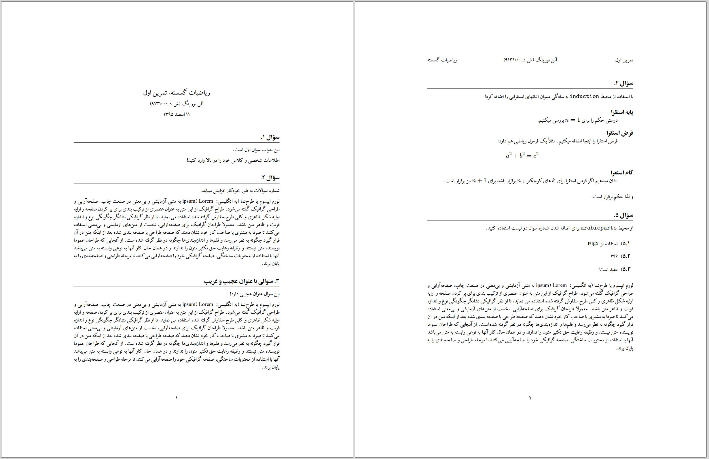

# LaTeX Homework Class

## What
This is a LaTeX document class. That means you use it with `\documentclass{homework}` at the top of the document. It provides a document layout and some helper commands that make working with questions easy.

## Installation
Certainly the easiest way to start using this template is to copy the .cls file to your computer in the same directory as your LaTeX project directory.

A better way to install this template is to fork this repository and then clone that fork to a particular folder on your computer:

```
git clone https://github.com/<your-username>/latex-hw-template
```

Then, whenever you need to use the template, you can copy the template to wherever you need it. Also, if there are ever any updates, you can simply run

```
git pull
```

to update the template.

The best way to install this file is to follow the instructions [here][install], keeping in mind that you're trying to install a `.cls` file instead of three `.sty` files.

[install]: https://github.com/Z1MM32M4N/latex-solarized#installation

## Usage

See the [homework.tex](homework.tex) file for an exhaustive list of usage examples. There are also comments explaining features for which there are no examples given.

The result is the following:



The class file also has a bunch of helper `\usepackage`s that you might want to take a look at in [homework.cls](homework.cls).

### `\question`

To start a question, just type `\question`. It will add the text "Question #" with a line underneath to the document. If you'd like to change "Question" to something else, use

```tex
\renewcommand{\questiontype}{Whatever You Want}
```

See [homework.tex](homework.tex) for more.

### `\question*`

Some classes like to give their homework questions fancy names. If this is the case, you can use `\question*{The Question's Name}` to make a named question.

See [homework.tex](homework.tex) for more.

### Question Parts

Another common thing on homework assignments is to have multi-part questions. To deal with these, use the form

```tex
\begin{alphaparts}
  \questionpart
    This will be part (a).
  \questionpart
    This will be part (b).
\end{alphaparts}
```
or
```tex
\begin{arabicparts}
  \questionpart
    This will be part x.1.
  \questionpart
    This will be part x.2.
\end{arabicparts}
```

See [homework.tex](homework.tex) for more.

### Induction Proofs

In math classes, induction proofs come up a lot, and they almost always have the same form: base case, induction hypothesis, and induction step.

```tex
\begin{induction}
  \basecase
    This is my fancy base case.
  \indhyp
    Assume some claim.
  \indstep
    Finish off the proof
\end{induction}
```

## License
MIT License, see [LICENSE](LICENSE).
